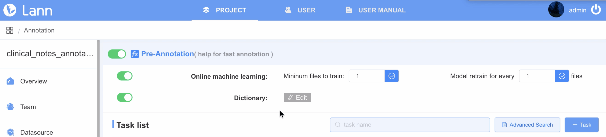

# Pre-annotation and suggestions

As annotating a corpus from scratch may be a time-consuming and costly process, LANN offers an advanced feature called "pre-annotation" function which facilitates this process. The "pre-annotation" function uses online machine learning and customizable dictionaries uploaded by users.

<!-- [screen shot](../_gif/pre-annotation.gif ) -->

# Suggestions, Pre-annotations and Model Analytics

<!-- [video](../_videos/pre-annotation.mp4 ':include :type=video') -->

With LANN you can upload existing annotations, the output of your models and dictionaries. You can use these in two ways either

1. As Pre-annotations to help your team work faster

2. To review the outputs of NLP models and refine their outputs.

