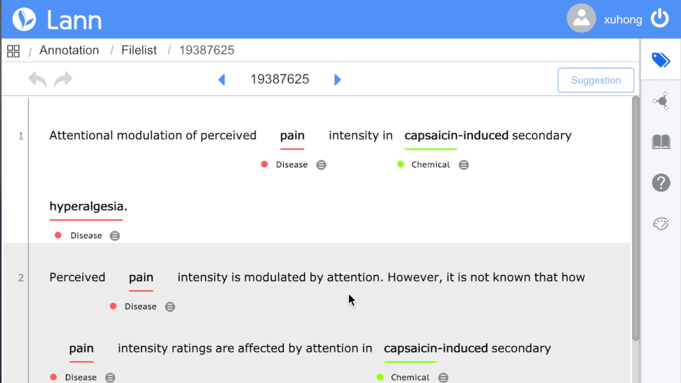
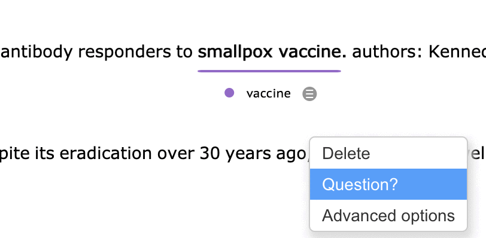

# During annotation you can also ...

Several helpful functions are provided to assisting you during annotation. Click the icons on the right panel and they will be activated:

- Edit the annotation schme of entities and relations

- Make the right floating window static and adjust its size

- Read and Edit the annotation guilde

- Post questions about annotations

- Change Visualization of entity & relation

