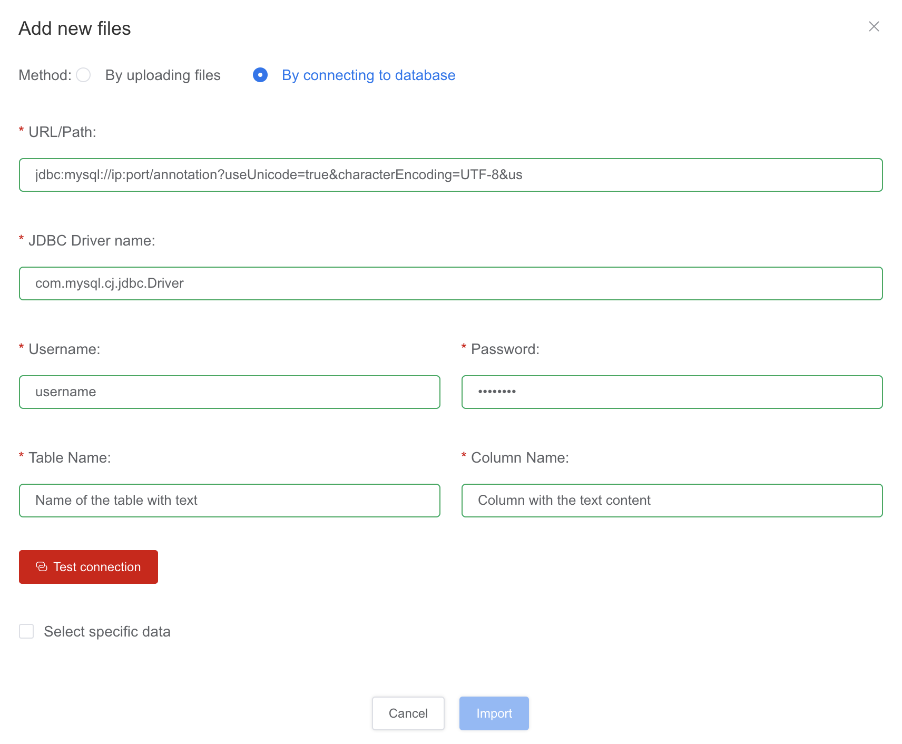

# Read text data from databases

For on-premise users, after you have created a project, click  on the left menu, then click  on the top right to add data into the project:

Then select the  option

In this interface, you can configure the URL/Path, JDBC Driver name, and login information for database connection. Please also specify the table name and the column that the data is stored in.

Click the button of test connection to check if the database can be connected.

Once the database is connected normally,  from the table:

You can select the starting and ending rows to further specify scope of the data. Before that, the data could be ordered by a specific field ascendingly or decliningly.

