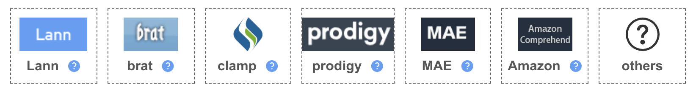

# Upload text and pdf files

After you have created a project, click  on the left menu, then click  on the top right to add data into the project:

> Upload unannotated files

Files to be annotated can be directly dragged and dropped to the file box, or selected from the file dictionary.

Then click the  button to upload them.

* Both files with a [ **.txt**] suffix and PDF files with a [ **.pdf** ] suffix can be annotated in LANN.

> Upload annotated files

If you have already annotated files using other tools, fortunately, they can also be uploaded and annoated in LANN.

Click to open the  option, then select your annoation platform below:

<!--  -->

LANN currently provides accomodation to several common annotation tools, including prodigy, CLAMP, MAE, AWS, and Brat.

Click the  button of each tool, to see the required format of the tool with sample data.

After drag and drop files to the file box, or select them from the directory, click the  button.

