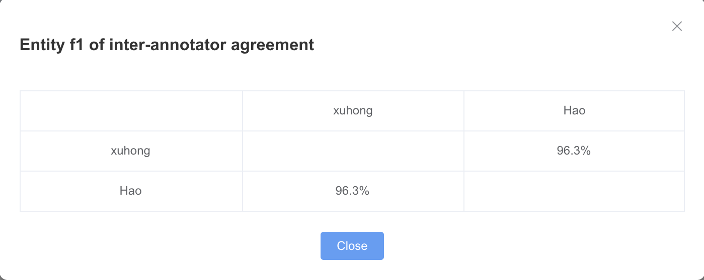
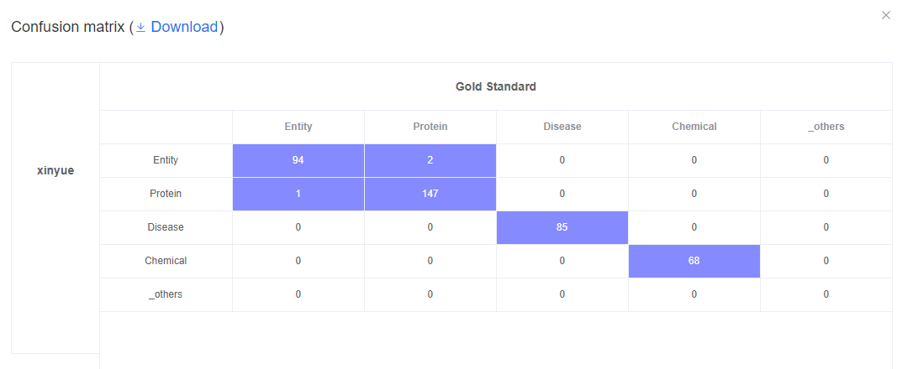
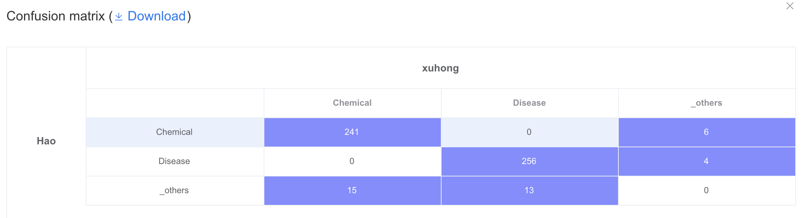
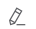
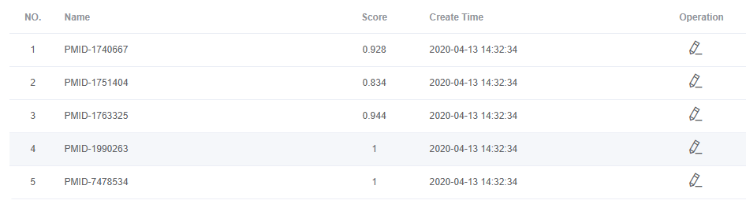
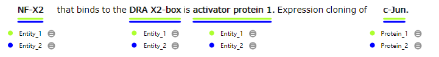

# How to get high-quality annotations

> What is IAA (Inter-Annotator Agreement)

The Inter-Annotator Agreement (IAA) gauges the quality of your annotation project, that is the degree of consensus among your annotators. If all your annotators make the same annotations independently, it means your guidelines are clear and your annotations are most likely correct. The higher the IAA, the higher the quality.

Before start annotating large amounts of data, it is recommended to train our annotators appropriatly. During this process, annotators will get familar with the data, draft and refine the annotation guideline. This process usually contains several rounds. In Round n, a small set of files are annotated by all annotators, and their IAA will be calculated automatically. In LANN, IAA is mainly calculated using [ **F1** ]. The [ **Cohen Kappa value** ] is reported sometimes. 

> Inter-annotator agreement matrix

It contains the IAA scores between pairs of annotators. 

* IAA matrix of multiple annotators 

In each round of training, the IAA matrix of multiple (at least two) annotators  will be displayed by clicking the  icon on the right corner of  > Round n. Only finalized annotation files will be used for IAA calculation.

For example, Vega and Joao agree on the 87% of the cases. Vega and Gerard on the 47%. This visualization provides an overview of the agreement among annotators. It also helps find weak spots. In this example we can see how Gerard is not aligned with the rest of annotators (25%, 47%, 35%, 18%). A training might be required to have him aligned with the guidelines and the rest of the team. On the top left we find the annotation task name, id and the agreement average (59,30%).

Make sure you train appropriately members joining the annotation project. If you find annotators that do not agree with most of members from the team, check the reasons, make your guidelines evolve and train them further. Once the IAA scores are satisfying, you can move forward to large-scale data annotation.

* IAA matrix between two annotators

A single annotator matrix of multi annotators can not provide enough details of annotation discrepencies. LANN also provides a series of functions under  >  to compare annotations of each pair of annotators, or a new annotator and the current gold standard annotations.

> How to check agreement between two annotators in details

First, click the  button to create a new task.

Then choose whether you want to do the agreement check between two annotators, or between an annotator and the currently assigned gold standard. If you are an annotator, you can only choose to compare yourself with another annotator or with the gold standard.

After the selection, the IAA scores will be automatically calculated and displayed on the task panel. Both values of F1 and Cohen Kappa will be displayed. IAA scores of entity and relation annotation tasks will be displayed seperately.

Click the confusion matrix in the task panel, a table will pop up illustrating the confusion between each pair of semantic types. The confusion matrixes of entities and relations will be displayed seperately.

For example, both Hao and Xuhong annotated 256 entities as [ **Disease** ]. Hao also annotates another 4 as [ **Disease** ], while Xuhong annotates another 13 as [ **Disease** ].

> Resolving annotation discrepencies

Click  in the task panel under  > , we can see a list of files with IAA scores for each of them. The annotation discrepencies between two annotators or an annotator with gold standard can be visulized by clicking the  icon in the line of each file.

<!--  -->

For example, the annotations of Angela and Hao are displayed in the same annotation file. The labels from Angela are indicated by "\_1" and those from Hao are indicated by "\_2".

Administrator can view their discripencies in this view and edit the annotations by adding, replacing or deleting labels, then click the  button on the top right to generate the gold standard version. All the remaining labels after the adjunction by administrator will be kept as the gold standard. Such gold stanard annotation is considered as generated by an extral annotator - [ **Gold** ]. For example, if we currently have three team members, the gold standard annotation after adjunction is labeled as from Annotator_4 - [ **Gold** ]. The gold standard file can be opened by clicking the link under the name of [ **Gold** ] in   > .

