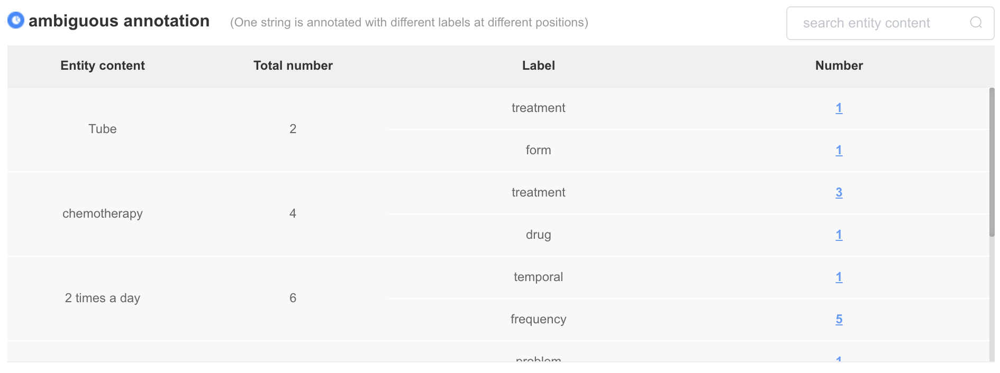
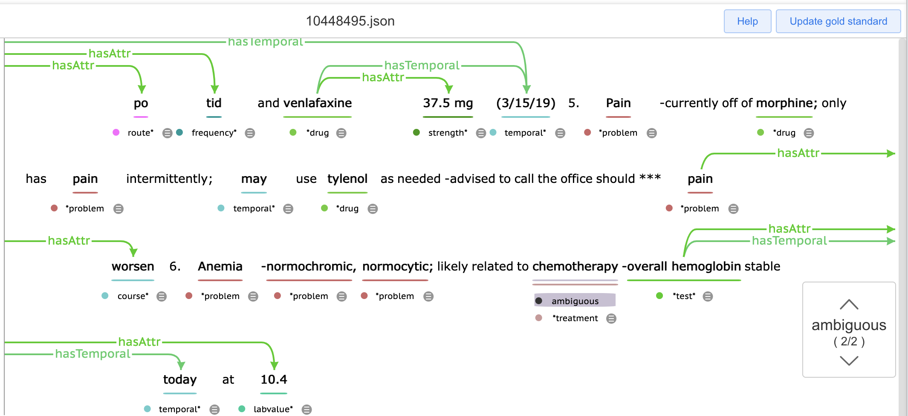

# Quality Test

> Quality Test contains several automatic quality measures of gold-standard annotations to help you fix potential annotation errors.

> Ambiguous annotation

One string is annotated with different labels at different positions.

<!-- [demo video](https://youtu.be/xxxxx':include :type=iframe width=100% height=400px') -->

> Potential missing annotation

One string is annotated at some positions and not annotated in other positions.

<!-- [demo video](https://youtu.be/xxxxx':include :type=iframe width=100% height=400px') -->

> Annotation overlap

Two annotations are overlapped, and one annotation is not a substring of another.

<!-- [demo video](https://youtu.be/xxxxx':include :type=iframe width=100% height=400px') -->

> Self-prediction discrepancy

A machine learning based model is trained on current gold-standard annotations, which will be used to predict named entities and relations from the same gold-standard annotations. High-quality annotations will yield performance highly close to 1. Discrepancy between annotations and predictions needs to be examined.

