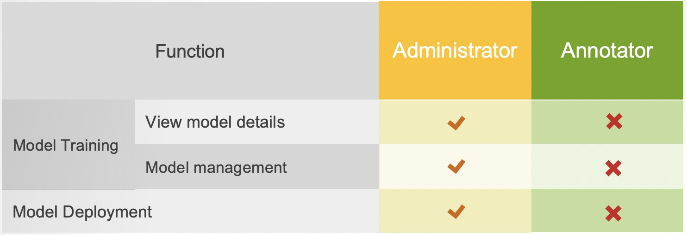

# Configuration and Project Management

## Core Management Concepts

* Datasets
* Schemas
* Task Definitions
* Teams
* Relations

Every annotation project is different and needs to be managed accordingly. This section introduces the core concepts that make up an annotation project in LANN and how you can configure them. This section gives a detailed explanation of each concept.

The difficult part of labeling data is keeping track of who did what and what each person should do next. LANN makes that easy by automating it for you. The core concepts shown below are the tools you’ll use to tell LANN what you want to do and how you want it completed.

## What Needs To Be Done

Whenever you or your annotators log in, you’ll be assigned a Task - a unit of work that needs to be completed. As a manager, you’ll tell LANN what work needs to be completed by making a Task Definition. A Task Definition specifies what data to label (a Dataset), which concepts to label it with (A Schema) and who should be doing the labeling (A Team).

## How it Should Be Done

You’ll want to configure your annotation project to be completed in a particular way, for example. - We want three people to annotate each example to ensure quality. - We want one person to label each example to maximize throughput. - We want to show multiple examples together so that annotators can see the broader context. - We want to provide suggestions to our annotators from our existing models and dictionaries. - We want to specify guidelines that annotators can access.

These options and many more, are configured in the Task Definition, Dataset and Schema objects described below. Again, if you’re looking for a specific way to do something, take a look at the recipes section as well.

## How Can LANN Help Me ?

1. LANN’s Annotation Interface makes entity annotation and relation annotation easy and fast.
3. LANN’s review mode and analytics give you insights on the quantity and quality of your labeled data and models
4. LANN’s support for external models let’s you speed up your annotators and review your production models.

## A Typical Use Case

>What Needs To Be Completed

Bob has a dataset of 1000 tweets. He’d like to annotate the entities in them as either Person or Location. Bob’s friend, Alice, is going to label with him. Bob wants to get through the data as fast as possible, so he wants each tweet to be labeled by either Alice or Bob, but not both.

>Setting It Up in LANN

To Implement this in LANN, Bob

1. uploads his tweets as a new Dataset
2. defines a Schema with the Tags Person and Location.
3. creates a new Task Definition, that says ” Label my tweets Dataset with my Schema. I want each tweet to be labeled exactly once”

>LANN Data

After creating the Task Definition, whenever Alice or Bob log-in to LANN, LANN will serve them data to label. Once they complete annotating an example and submit it, LANN will give them the next example to annotate, until the task is complete.

## Team setup

There are three different roles in a team: project creator, administrator and annotator. However, project creator is usually the administrator by default unless otherwise designated. Detailed previliges of each role is listed in the following tables:

  

  

  

  

 

  
