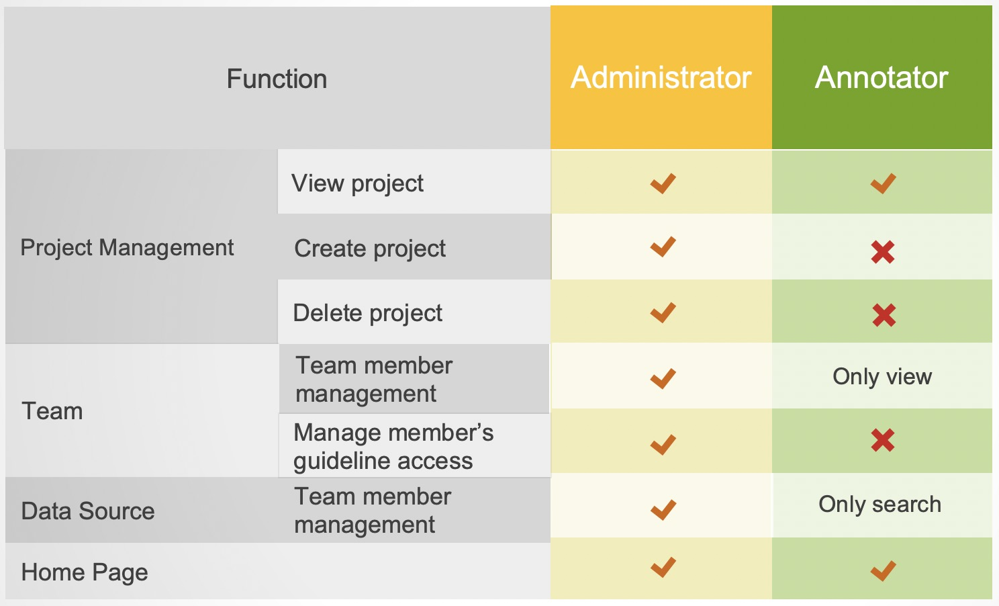
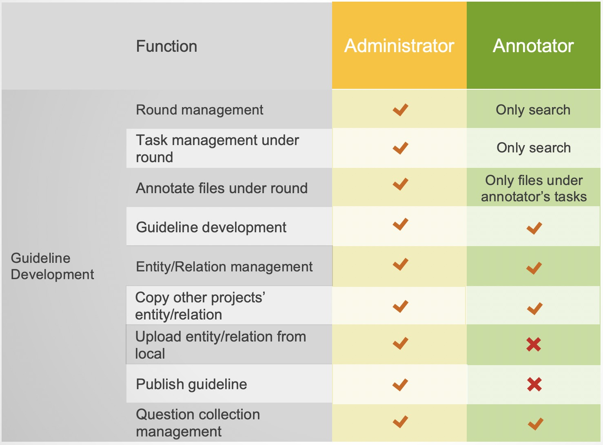
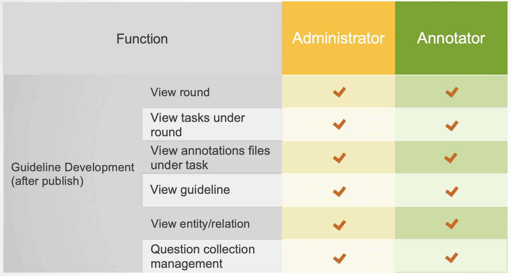
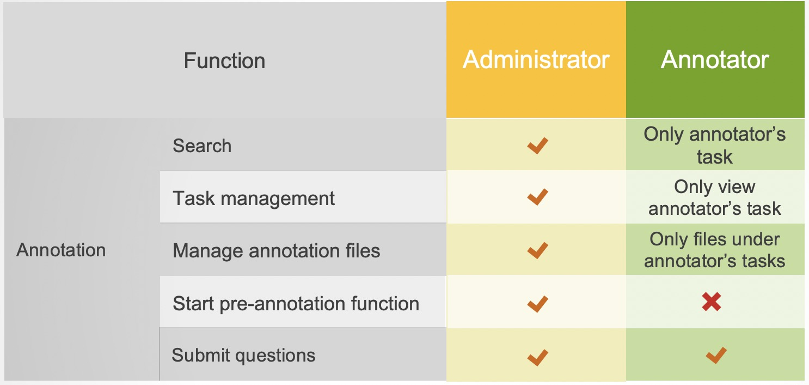
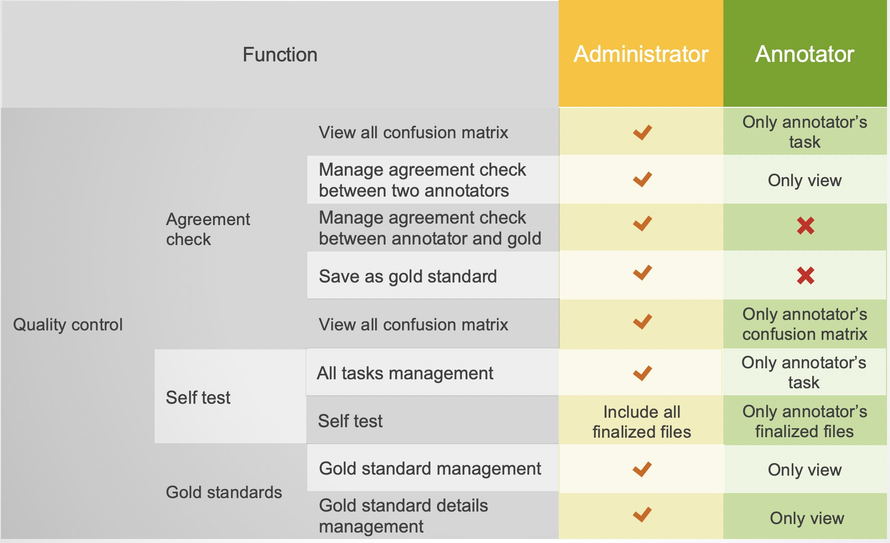

# Configuration and Project Management

## Core Management Concepts

* Data sources
* Annotation Guideline
* Task Assignment
* Progress check
* Quality control
* Email notification
* Teams

Every annotation project is different and needs to be managed accordingly. This section introduces the core concepts that make up an annotation project in LANN and where you can configure them. 

The difficult parts of labeling data together as a team are (1) keeping track of who did what and what each person should do next, (2) keeping every team member on the same page regarding what information should be annotated, (3) keeping a high quality of the annotations in an efficient way. LANN makes that easy by automating it for you. The core concepts shown below are the modules you’ll use to tell LANN what you want to do and how you want it completed.

## What Needs To Be Done

Whenever you or your annotators log in, you’ll be assigned a Task - a unit of work that needs to be completed. As a manager, you’ll tell LANN what work needs to be completed by making a Task Definition. A Task Definition specifies what data to label (a Dataset), which concepts to label it with (A Schema) and who should be doing the labeling (A Team).

## How it Should Be Done

You’ll want to configure your annotation project to be completed in a particular way, for example: 
- We want three people to annotate each example to ensure quality. 
- We want one person to label each example to maximize throughput. 
- We want to provide suggestions to our annotators from our existing models and dictionaries. 
- We want to specify guidelines that annotators can access. 
- We want to review works from annotators to correct errors and reject any file that is poorly annotated.

These options and many more, are configured in the modules of Guideline, annotation, and quality control, which will be described in each section. 

Moreover, you may also want to have more advanced functions specific to progress management, for example: 
- We want to keep track of the number of annotated files finished by each annotator and how much time spent.  
- We want to let the team members know instantly when tasks are assigned or automatic quality test is finished.

An overview dashboard is provided for each project to summarize the on-going tasks and progress of each annotator. In addition, emails will be sent to annotators when new activities related to them happen in LANN.

## How Can LANN Help Me ?

1. LANN’s Annotation Interface makes entity annotation and relation annotation easy and fast.
3. LANN’s review mode and analytics give you insights on the quantity and quality of your labeled data
4. LANN’s support for uploading existing annotations done with other softwares for effortless switching of annotation tools
5. LANN’s suggestions of annotations speed up annotators through online model training and dictionary based automatic annotations.

## A Typical Use Case

>What Needs To Be Completed

Mann has a dataset of 500 articles. She’d like to annotate the entities in them as either person or Location. Mann’s friend, Tom and Jerry, are going to label with her. Mann wants to annotate the data with a high quality, so she wants to start with letting both of her friends annotate the same small dataset with 100 articles and measure their agreement. 

>Setting It Up in LANN

To Implement this in LANN, Mann

1. uploads her articles as a new Dataset
2. defines an Annotation Schema with the Labels of Person and Location.
3. creates a new Task Definition, that says ” Label 100 of my articles with the defined Annotation Schema. I want each artile to be labeled by two annotators”

>LANN Data

After creating the Task Definition, whenever Tom or Jerry log-in to LANN, LANN will serve them data to label. Once they complete annotating an article and submit it, LANN will give them the next article to annotate, until the task is complete. During this process, the inter-annotator agreement between Tom and Jerry can be calculated as long as they have annotated at least one same article.

## Team setup

There are three different roles in a team: project creator, administrator and annotator. However, project creator is usually the administrator by default unless otherwise designated. Detailed previliges of each role is listed in the following tables:

  

  

  

  

 
